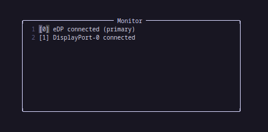

# 🖥️monitor.nvim🖥️
Never want to leave your lovely Neovim surrounding? Then *monitor.nvim* is the perfect plugin for you    
Manage your Monitor-Setup through Neovim without leaving it ..Today!
## Installation
It should be installable through all common nvim plugin-manager
In addition you need to install: [plenary.nvim](https://github.com/nvim-lua/plenary.nvim)

For example with **Lazy.nvim**:
```
    {
        "HannHank/monitor.nvim",
        dependencies = {"nvim-lua/plenary.nvim"}
    }

```

## Usage
For now after installation the command :*Monitor* will be (hopefully) available in neovim. 
The UI is basically just a floating buffer that gets filled with the current configuration of your setup.

For example:



- With *\[\*\]* you can define your display groups and group your monitors like a charm -> Same group = **Same output**
- *[-1]* stands for **not configured** and you can also use this to *disable* a connected monitor
- By *moving* the lines, you can adapt the left and right placement of the montiors around the **primary** one. 
    - Above = **placmenet to the left**
    - Below = **placement to the right** 
So for instance, in my setup **DisplayPort-0** is below my **Primary** Monitor and therefore to the right of **eDP**
### Mapping
- *Enter* -> closes the window and active the setting 
- *space + t* -> runs the current setting, but keeps the buffer open


## Motivation
The plugin does not really solve any problem in general. I just wanted to learn how to write *Neovim* plugins and always used xrandr in the terminal.
For me it is faster and easier to use this plugin to manage my monitors despite that there is also a bunch of graphical implementation for that, like: [arandr](https://christian.amsuess.com/tools/arandr/)

So I set a timer of around 2hours and wrote this plugin. The code is not very robust with a lost of regex magic and things that could be done cleaner with more time.
Maybe in the future I will upate this to be more cleaner and support custom config to setup keybindings and maybe even profiles to save current configs.


